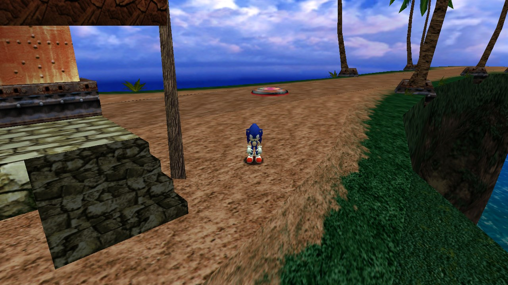

# Sublevels

You only get one check for each sublevel (or two if harder versions are enabled).
You don't have to complete it with every character.

Sky Chase are normally accessed through the story, so the mod adds warp platform to enter them.

### Sky Chase Act 1

- **Characters**: Sonic and Tails.
- **Area**: Mystic Ruins' main area. Take the warp platform in the runway, outside of Tails' Workshop.
- **Item Requirements**: None.

### Sky Chase Act 2

- **Characters**: Sonic and Tails.
- **Area**: Egg Carrier's main area. Take the warp in the runway, near the Chaos 6 boss fight.
- **Item Requirements**: None.

### Twinkle Circuit

- **Characters**: Everyone.
- **Area**: Twinkle Park's lobby in Station Square.
- **Item Requirements**: None. (You'll need the Twinkle Park Ticket to enable the elevator).

### Sand Hill

- **Characters**: Sonic and Tails.
- **Area**: Jungle in Mystic Ruins.
- **Item Requirements**: None.

